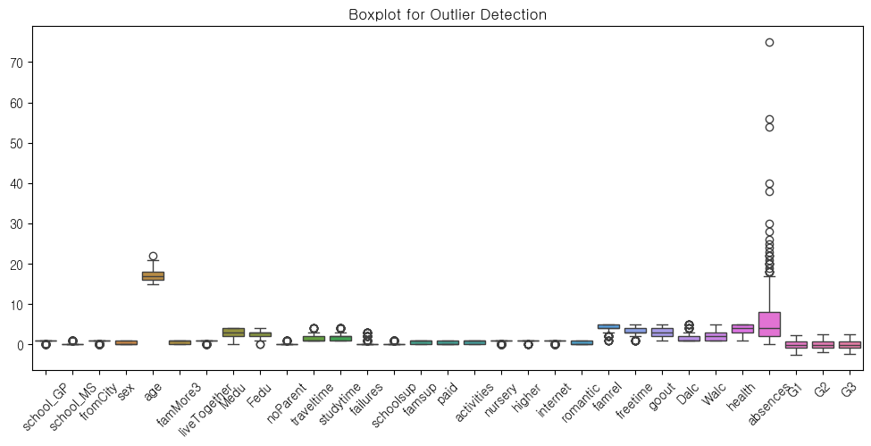
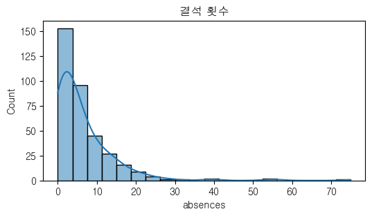
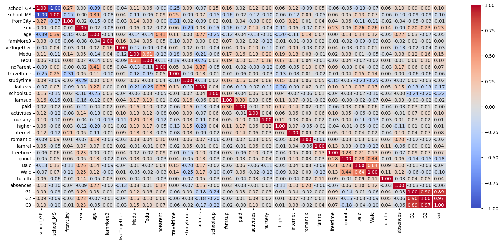
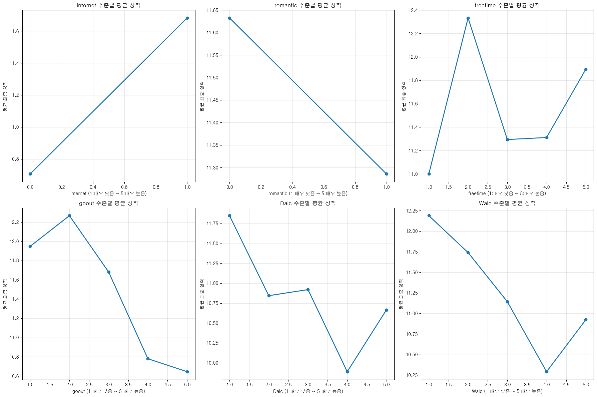
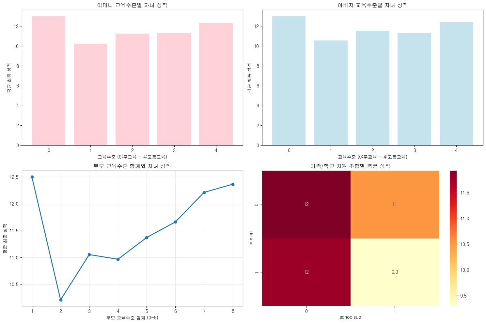
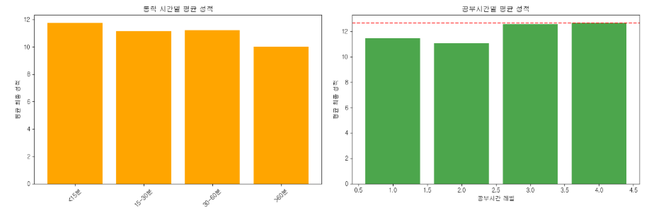
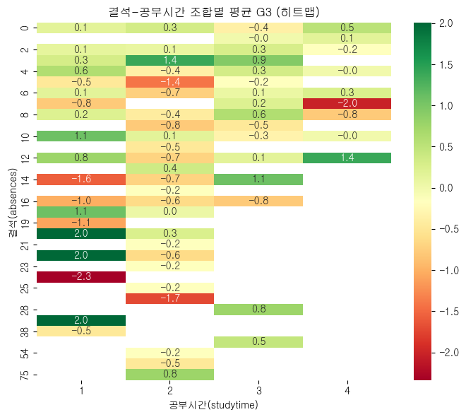
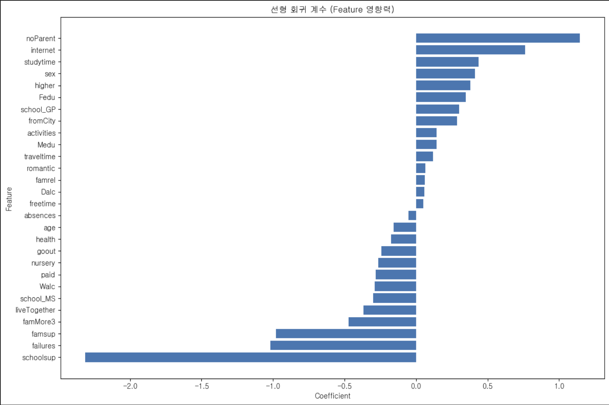
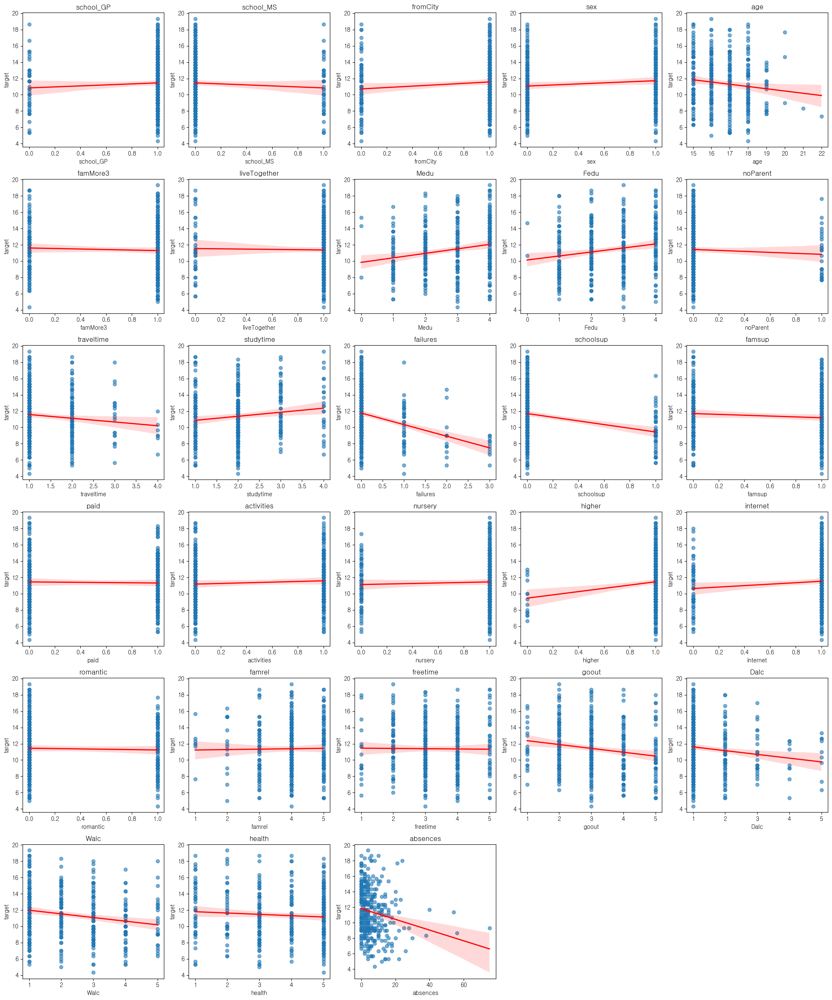
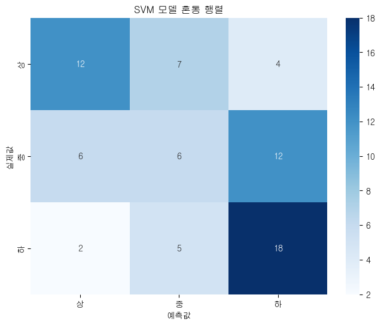

#  
 🙋F킬러 팀원 소개   
 

  <table>
  <tr>
    <td align="center"> 
         
       
      김민정
       
      <a href="https://github.com/MinJeung-Kim"><b>@MinJeung-Kim</b></a> 
    </td> 
    <td align="center"> 
         
       
    정종현
       
      <a href="https://github.com/myem21"><b>@myem21</b></a> 
    </td>
   <td align="center"> 
         
       
      박소희
       
      <a href="https://github.com/xxoysauce"><b>@xxoysauce</b></a> 
    </td> 
   <td align="center"> 
        
        
      오하원
       
      <a href="https://github.com/Hawon-Oh"><b>@Hawon Oh</b></a> 
    </td> 
  </tr>
</table>

 

#  
 📆 WBS   
  

<table border="1">
  <thead>
    <tr>
      <th>날짜</th>
      <th>담당자</th>
      <th>산출물</th>
    </tr>
  </thead>
  <tbody>
    <tr>
      <td>9월15일-16일</td>
      <td>공통</td>
      <td>주제 조사, 확정</td>
    </tr>
    <tr>
      <td>9월17일-18일</td>
      <td>공통</td>
      <td>데이터 수집, 정제</td>
    </tr>
    <tr>
      <td>9월19일-22일</td>
      <td>공통</td>
      <td>전처리, EDA</td>
    </tr>
    <tr>
      <td>9월22일</td>
      <td>공통</td>
      <td>결과자료 정리</td>
    </tr>
  </tbody>
</table>

 

#  
 🚩 프로젝트 주제 및 선정 배경  
  
## 0. 주제
### 성적 예측 및 영향 요인 분석 🧐

## 1. 환경적 배경 (Background)

- **디지털 환경 확산 → 청소년 생활 패턴 변화**
    
    디지털 환경 확산, 사교육 의존도 증가, 부모 맞벌이 등 사회 변화가 청소년 학습 시간, 생활습관, 가정환경에 큰 영향을 미침.
    
- **청소년 정신건강·생활습관 악화 기사 근거**

- “청소년 스트레스 인지율 역대 최고” (경향신문, 2024)
  

- “학업 고민… 청소년 정신건강에 빨간불 켠다” (원불교신문, 2023)
- **코로나19 이후 교육 격차 심화**
    
    원격수업, 등교일수 감소 → 학업 성취도 격차 확대, 부모 지원·사교육 접근성에 따른 성적 차이 심화.
    

---

## 2. 문제 인식 (Problem Awareness)

- **다차원적 요인이 성적에 미치는 영향에 대한 체계적 분석 부족**
    
    성적과 학습 시간, 가정환경, 생활습관, 건강 요인 간 관계에 대한 정량적 탐색 필요.
    
- **조기 위험 신호 포착 어려움**
    
    성적 급락 학생 조기 발견과 맞춤형 지원 정책 설계가 체계적 근거 부족으로 한계.
    
- **사회적 불평등과 연결 가능성**
    
    부모 학력, 가정 지원(famsup), 생활습관 차이가 성적 차이와 직결될 가능성 존재.
    

---

## 3. 목적 (Purpose)

- **데이터 기반 학업 성취도 영향 요인 도출**
    
    성적(G3)에 영향을 주는 학업, 생활, 가정환경, 건강 요인을 통계적·시각적으로 분석.
    
- **성적 향상 전략 제시**
    
    조기 위험 학생 탐지, 맞춤형 학습·생활 지원 전략 마련 근거 제공.
    
- **사회 문제 해결 기여**
    
    교육 격차 해소, 청소년 정신건강 관리, 생활습관 개선 등 정책적·교육적 시사점 도출.

 

#  
 📑 데이터셋 
  
- 데이터 출처 : [UCI Adult](https://archive.ics.uci.edu/datasets?skip=0&take=10&sort=desc&orderBy=NumHits&search=Student+Performance)
- 파일 명 : `after_scaling.csv`, `before_scaling.csv` 

## 🔍 전처리한 데이터셋 컬럼설명

| 순번 | 영문 컬럼명 | 한국어 번역 | 데이터 타입 | 상세 설명 |
| --- | --- | --- | --- | --- |
| 1 | school_GP | GP학교 | 이진 | 학생이 다니는 학교 (GP: Gabriel Pereira) |
| 1 | school_MS | MS학교 | 이진 | 학생이 다니는 학교 (MS: Mousinho da Silveira) |
| 2 | sex | 성별 | 이진 | 학생의 성별 (0: 여성, 1: 남성) |
| 3 | age | 나이 | 수치형 | 학생의 나이 (15-22세) |
| 4 | fromCity | 도시거주 | 이진 | 집 주소 유형 (0: 시골, 1: 도시) |
| 5 | famMore3 | 가족규모 | 이진 | 가족 크기 (0: 3명 이하, 1: 3명 초과) |
| 6 | liveTogether | 부모동거상태 | 이진 | 부모의 동거 상태 (1: 함께 거주, 0: 별거) |
| 7 | Medu | 어머니교육수준 | 수치형 | 어머니 교육 (0: 무교육, 1: 초등교육, 2: 5-9학년, 3: 중등교육, 4: 고등교육) |
| 8 | Fedu | 아버지교육수준 | 수치형 | 아버지 교육 (0: 무교육, 1: 초등교육, 2: 5-9학년, 3: 중등교육, 4: 고등교육) |
| 12 | noParent | 부모보호자여부 | 이산형 | 학생의 부모가 보호자 (0: 부모가 보호자로 없음, 1: 부모가 보호자로 존재) |
| 13 | traveltime | 통학시간 | 수치형 | 집에서 학교까지 시간 (1: 15분 미만, 2: 15-30분, 3: 30분-1시간, 4: 1시간 초과) |
| 14 | studytime | 주간공부시간 | 수치형 | 주당 공부 시간 (1: 2시간 미만, 2: 2-5시간, 3: 5-10시간, 4: 10시간 초과) |
| 15 | failures | 과거낙제횟수 | 수치형 | 이전 과락 횟수 (1-3회, 4: 3회 이상) |
| 16 | schoolsup | 학교추가지원 | 이진 | 추가 교육 지원 (yes: 있음, no: 없음) |
| 17 | famsup | 가족학습지원 | 이진 | 가족의 교육 지원 (yes: 있음, no: 없음) |
| 18 | paid | 유료수업 | 이진 | 해당 과목 유료 수업 (yes: 수강, no: 미수강) |
| 19 | activities | 과외활동 | 이진 | 교과외 활동 참여 (yes: 참여, no: 미참여) |
| 20 | nursery | 유치원경험 | 이진 | 유치원 다닌 경험 (yes: 있음, no: 없음) |
| 21 | higher | 고등교육희망 | 이진 | 고등교육 진학 희망 (yes: 희망, no: 미희망) |
| 22 | internet | 인터넷접근 | 이진 | 집에서 인터넷 접근 (yes: 가능, no: 불가능) |
| 23 | romantic | 연인관계 | 이진 | 연애 관계 여부 (yes: 있음, no: 없음) |
| 24 | famrel | 가족관계품질 | 수치형 | 가족 관계의 질 (1: 매우 나쁨 ~ 5: 매우 좋음) |
| 25 | freetime | 여가시간 | 수치형 | 방과 후 자유 시간 (1: 매우 적음 ~ 5: 매우 많음) |
| 26 | goout | 외출빈도 | 수치형 | 친구와 외출 빈도 (1: 매우 적음 ~ 5: 매우 자주) |
| 27 | Dalc | 평일음주 | 수치형 | 평일 알코올 소비 (1: 매우 적음 ~ 5: 매우 많음) |
| 28 | Walc | 주말음주 | 수치형 | 주말 알코올 소비 (1: 매우 적음 ~ 5: 매우 많음) |
| 29 | health | 건강상태 | 수치형 | 현재 건강 상태 (1: 매우 나쁨 ~ 5: 매우 좋음) |
| 30 | absences | 결석횟수 | 수치형 | 학교 결석 횟수 (0-93회) |
| 31 | G1 | 1차성적 | 수치형 | 1학기 성적 (0-20점) |
| 32 | G2 | 2차성적 | 수치형 | 2학기 성적 (0-20점) |
| 33 | G3 | 최종성적 | 수치형 | **최종 성적 (0-20점) - 예측 대상** |

 

🛠️ EDA

<!-- summary 아래 한칸 공백 두어야함 -->

#  
 🛠️ 전처리 과정 
    
**1. school &rarr; 학교명별로 One-Hot 인코딩으로 변환**

 

**2. str타입으로 저장된 이진값들을 int형으로 변환**

 

**3. 해석하기 난해한 특성 제거**
- FJob & MJob: 부모직업에 others가 많음. 상관관계가 있더라도 분석이 불가함.

 
 

**4. G1, G2, G3(시험점수)에 결손치가 없는 것 같지만 0으로 표기되어있음.**
- 시험 안보면 출석기록도 0으로 표시됨. 해당과목을 drop하면 시험/출석은 0
- 결손치 제거 후 시험성적은 정규분포 스케일링함.

**5. 결석률 이상치 발견했으나 유지**
- 20 ~ 80번 결석한 학생이 존재. 값은 이상치이나 결석 많이 한 학생은 존재할 수 있기에 데이터입력 오류아님. 적은 개수도 아니라 EDA에 필요하다 판단
- 과목을 drop한(시험안본) 학생은 자동으로 결석이 0이 됨. 즉 이상치조차 해당과목을 패스한 학생의 데이터

 
 

 

**6. 전처리 전/후 상관계수 매트릭스**
- 전처리 전

 

- 전처리 후 뚜렷해진 부분이 생겼으나 아직 분석이 어려움. &rarr; EDA로 넘어감

 

 

#  
 🌟 EDA 결과 
  
**학생성적에는 다양한 특성들이 기여. 특성들간의 기여도 및 관계성에 대해 분석해봄.**

**1. 대체로 선형적이나 개수가 적은 수치에서 그래프가 튐. 추후 머신러닝의 확률이 낮다면 해당 특성에서 문제가 발생했을 가능성있음.**

 

 

**2. 부모 한쪽의 교육수준만 고려 시 학생성적에 큰 영향이 없으나 부모를 합쳐서 계산하면 차이 존재.**

 

📊 가족 배경 요인과 성적 상관관계:

  - Medu: 0.190 (중간)
  - Fedu: 0.159 (중간)
  - famrel: 0.038 (약함)

💡 가족 배경 핵심 인사이트:

  - 고학력 부모(부모 교육수준 6+ 합계) 자녀 평균: 12.08점
  - 저학력 부모(부모 교육수준 2- 합계) 자녀 평균: 10.34점
  - 교육격차: 1.73점
  - 가족 지원 있는 경우: 11.35점
  - 가족 지원 없는 경우: 11.80점
  - 가족 지원 효과: -0.45점

**3. EDA를 통해 평균적으로 최적의 공부 환경 및 방법에 대해 유추가능**

 

💡 학습 습관 핵심 인사이트:
  - **최적 공부시간: >10시간 (평균 12.67점)**
  - 무결석 평균: 12.61점 vs 다결석(10회+) 평균: 10.15점
  - 결석의 부정적 영향: -2.46점

**4. 다양한 특성들이 성적에 기여하나 학생의 의지(failure, absences)와 학교의 서포트만으로도 성적향상 가능**

🏆 성과 향상 요인 중요도 순위 (TOP 5):
   1. failures       : 0.294 (높음) - 과거 낙제 횟수
   2. schoolsup      : 0.238 (중간) - 학교 추가 지원
   3. absences       : 0.213 (중간) - 결석 횟수
   4. parent_edu_combined: 0.195 (중간) - 부모 교육 수준
   5. Medu           : 0.190 (중간) - 어머니 교육 수준

⭐ 우수 학생들의 공통 특징 (16점 이상, 40명):
  - famsup: 1 (60.0%) - 가족 학습 지원
  - schoolsup: 0 (97.5%) - 학교 추가 지원
  - paid: 0 (67.5%) - 유료 수업
  - internet: 1 (92.5%) - 인터넷 접근 여부
  - activities: 1 (52.5%) - 과외 활동
  - higher: 1 (100.0%) - 고등 교육 희망

**5. 서로 다른 특성의 조합을 통해서도 분석이 가능**
- 공부시간을 늘려도 결석이 많으면 효과가 제한적
- 즉, 결석관리가 우선, 이후 공부시간 확보라는 전략적 메시지
- 결석이 적을수록 점수가 높고, 공부시간이 늘수록 더 높아지는 조합 효과를 색상으로 한눈에 볼 수 있음.
   결석 ↓ + 공부시간 ↑ 구간이 가장 진한 녹색 → 성적이 가장 높은 조합

 

  **5-1. 여가시간과 주말 음주에 따른 분석**
  

  | Walc (주말 음주) | freetime 1 | freetime 2 | freetime 3 | freetime 4 | freetime 5 | 관찰 포인트                        |
| ------------ | ---------- | ---------- | ---------- | ---------- | ---------- | ----------------------------- |
| 1            | 10.9       | **12.9**   | 12.0       | 11.8       | **14.0**   | 낮은 음주 + 적절한 여가 → 성적 상위 유지     |
| 2            | 10.0       | **12.9**   | 10.8       | 12.0       | 12.3       | 여가 2\~4 구간 안정적 성적, 극단값 없음     |
| 3            | **12.0**   | **12.3**   | 10.8       | 11.9       | **14.2**   | 음주 중간 레벨이지만 여가 5 레벨에서도 높은 성적  |
| 4            | 11.6       | 9.9        | 9.8        | 9.8        | 9.2        | **음주가 4 이상**이면 모든 여가 레벨 성적 급락 |
| 5            | 8.5        | 9.0        | 11.9       | 10.7       | 11.0       | 일부 구간에서 회복 있으나 전반적 성적 저하      |

 

 

#  
 🤖 ML 
 
### ❓ 어떤 요인이 성적에 영향을 미칠까?

### 1. 크게 유의미하지 않은 변수들

- 학교(school_GP, school_MS) 
- 성별(sex) 
- 가족규모(famsize)
- 인터넷 사용(internet)
- 과외(paid)
- 활동(activities)
- 연애관계(romantic)  
=> 학생 성적에 뚜렷한 `영향이 없는 것`으로 해석할 수 있다.

### 2. 성적과 음의 상관관계가 있는 변수들

- `나이(age)`: 나이가 많을수록 성적이 낮아지는 경향을 보임.
- `실패횟수(failures)`: 실패 경험이 많을수록 성적이 확실히 낮음.
- `결석(absences)`: 결석일수가 많을수록 성적이 크게 떨어지는 경향을 보임.
- `Walc(주말 음주)`: 주말 술을 많이 마시는 학생일수록 성적이 낮음.
- `Dalc(평일 음주)`: 평일 술을 마시는 학생도 성적이 낮은 경향이 있음.
- `health(건강상태)` 는 오히려 약간 부정적 경향—건강 점수가 높을수록 성적이 살짝 떨어지는 경향이 있는데, 이는 단순 상관관계 이상일 수 있음(예: 건강문제가 심하지 않은 학생들이 오히려 공부에 집중하는 경우).

### 3. 성적과 양의 상관관계가 있는 변수들

- 교육지원(famsup), 학교지원(schoolsup): 약간의 양의 상관이 보이지만 크지는 않음.
- higher(고등교육 희망 여부): 대학 진학 희망이 있는 학생일수록 성적이 높은 편.
- Medu, Fedu(부모 교육 수준): 부모 학력이 높을수록 학생 성적도 올라가는 경향이 보임.

### 4. 중요한 요인 요약

- 강한 영향 (직접적 상관관계 뚜렷): 실패횟수(failures), 결석(absences), 나이(age), 음주(Dalc/Walc).
- 중간 정도 영향: 부모 학력, 고등교육 희망 여부(higher).
- 거의 영향 없음: 성별, 활동 여부, 인터넷 사용 등.

### ✅ 종합 해석:
학생들의 성적은 **학업적 습관(결석, 실패 경험), 생활습관(음주), 연령, 교육적 태도(고등교육 의지)** 에 의해 크게 좌우되며, 성별이나 단순한 가족 요인, 인터넷 사용 여부 등은 거의 영향을 주지 않음을 알 수 있다.

 

### 🧐 SVM모델로 상/중/하 분류 예측

### 🔎 각 등급별 성능 분석
- 상 등급 (첫 번째 행):
    - 실제 '상' 23명 중 12명만 올바르게 예측 → 정확도 52.2%
    - 7명은 '중'으로, 4명은 '하'로 잘못 예측
- 중 등급 (두 번째 행):
    - 실제 '중' 24명 중 6명만 올바르게 예측 → 정확도 25.0%
    - 6명은 '상'으로, 12명은 '하'로 잘못 예측 (특히 '하'로 많이 오분류)
- 하 등급 (세 번째 행): 
    - 실제 '하' 25명 중 18명을 올바르게 예측 → 정확도 72.0%
    - 가장 잘 예측하는 등급

### ✅ 종합 해석:
상중하 분류는 연속적인 성적을 3개 구간으로 나눈 것이라 경계선 근처의 학생들은 구분하기 어려운 것이 자연스러운 현상임.

# 👩‍🎓GMM 클러스터링 및 학습 루틴 추천

  

- 클러스터링 결과 시각화

 

- 클러스터별 학생 수 
cluster
0     53
1     39
2    223

📊 GMM 클러스터링 결과 요약 (k=3)
1. 클러스터별 인원 수 & 성적 요약

| 클러스터 | 라벨   | 학생 수 | 평균 G3 | 중앙값 G3 |
| ---- | ---- | ---- | ----- | ------ |
| 0    | Low  | 53명  | 10.00 | 9.0    |
| 1    | Mid  | 39명  | 10.36 | 10.0   |
| 2    | High | 223명 | 12.23 | 12.0   |

- High 그룹: 전체의 약 66%, 평균 12.23점으로 성적 상위권

- Low 그룹: 전체의 약 16%, 평균 10.0점으로 성적 관리 필요

- Mid 그룹: 전체의 약 12%, 중간권 학생군

2. 주요 특성 비교

| 특성                | Low         | Mid        | High       | 인사이트 요약               |
| ----------------- | ----------- | ---------- | ---------- | --------------------- |
| 결석(absences)      | **14.81 ↑** | 10.49      | 3.98 ↓     | 출결이 성적에 큰 영향을 미침      |
| 공부시간(studytime)   | 1.72 ↓      | 2.03       | 2.16       | 성적 높은 그룹일수록 공부시간 확보 ↑ |
| 공부효율(study_eff.)  | **0.25 ↓**  | 0.37       | **0.90 ↑** | Low 그룹은 결석↑ → 공부효율 ↓  |
| 낙제(failures)      | 0.58        | **1.15 ↑** | **0.02 ↓** | Mid 그룹이 낙제 과목 가장 많음   |
| 음주(total_alcohol) | **6.64 ↑**  | 3.41       | 3.12       | Low 그룹 음주 습관이 가장 높음   |
| 외출(goout)         | **4.04 ↑**  | 2.72       | 2.91       | Low 그룹의 외출 빈도 높음      |

3. 클러스터별 맞춤 전략

#### [Low 그룹]

- 출결 관리 최우선: 결석 줄이기 위한 알림·상담 프로그램

- 공부 효율 개선: 포모도로 학습법, 집중 블록 학습 시간 확보

- 음주·외출 관리: 생활습관 교정 프로그램, 건강관리 지원

- 낙제 과목 보충: 기초 복습·보충수업 참여

#### [Mid 그룹]

- 낙제 과목 관리: 학습 진도 점검 + 개별 튜터링 지원

- 중간권 학생군 → 성적 향상 잠재력 있음

#### [High 그룹]

- 현재 루틴 양호 → 심화 학습, 대회 준비, 자기주도 학습 기회 제공

 

#  
 💡 프로젝트 기대 효과 
    
- 학습 데이터 분석을 통해 **학습자 특성별 차이, 성과 패턴, 이탈 요인** 등을 발견할 수 있다.
- 이는 단순한 데이터 분석을 넘어 **학습 방법 개선·맞춤형 교육·정책 제안** 같은 응용 가치가 있다.
