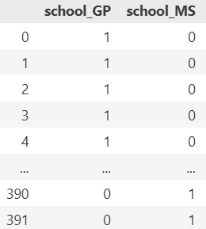
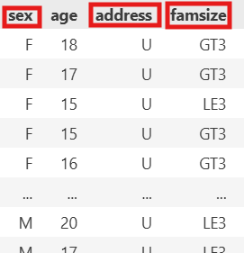
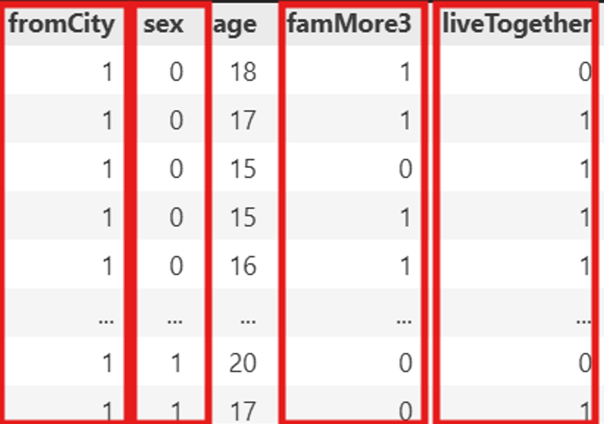
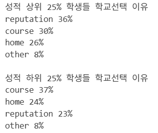
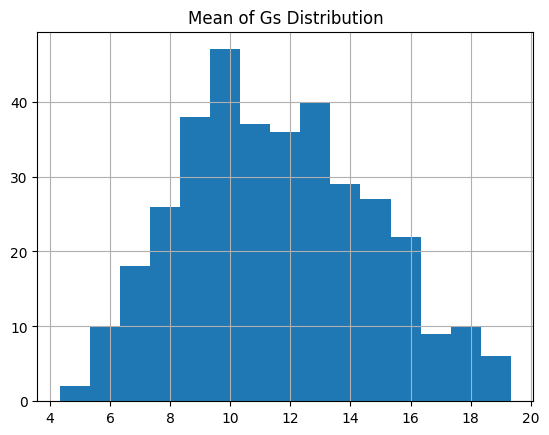
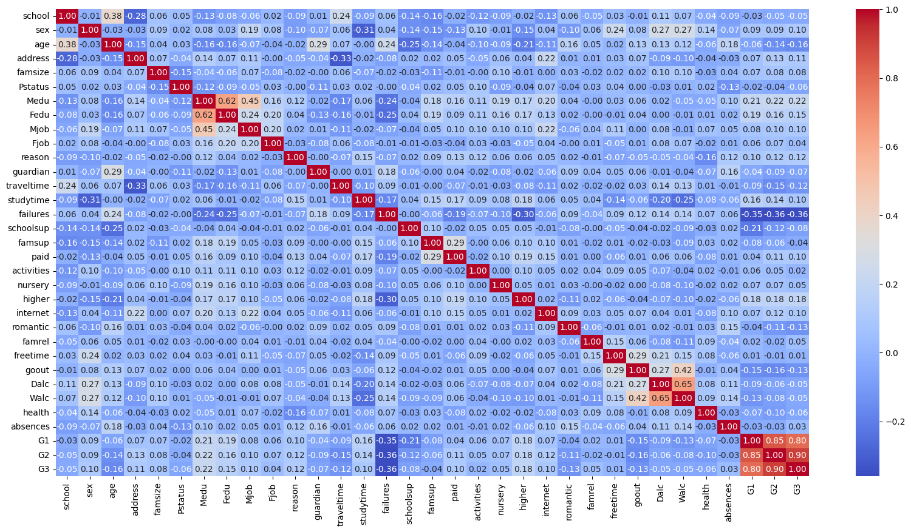
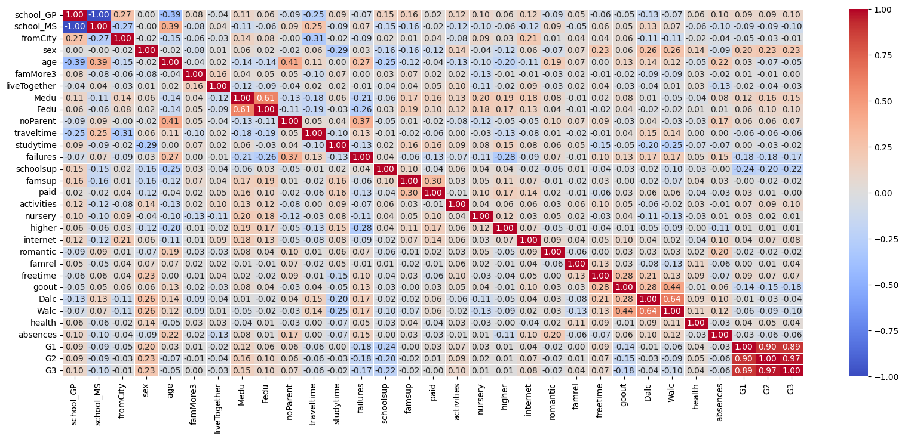

#  
 🙋팀원 소개   
 

  <table>
  <tr>
    <td align="center"> 
         
       
      김민정
       
      <a href="https://github.com/MinJeung-Kim"><b>@MinJeung-Kim</b></a> 
    </td> 
   <td align="center"> 
         
       
      박소희
       
      <a href="https://github.com/xxoysauce"><b>@xxoysauce</b></a> 
    </td> 
   <td align="center"> 
        
        
      오하원
       
      <a href="https://github.com/Hawon-Oh"><b>Hawon Oh</b></a> 
    </td> 
    <td align="center"> 
         
       
      정종현
       
      <a href="https://github.com/myem21"><b>@myem21</b></a> 
    </td>
  </tr>
</table>

 

#  
 📆 WBS   
  

<table border="1">
  <thead>
    <tr>
      <th>날짜</th>
      <th>담당자</th>
      <th>산출물</th>
    </tr>
  </thead>
  <tbody>
    <tr>
      <td>9월15일-16일</td>
      <td>공통</td>
      <td>주제 확정</td>
    </tr>
    <tr>
      <td>9월17일-18일</td>
      <td>공통</td>
      <td>데이터 수집 및 정제</td>
    </tr>
    <tr>
      <td>9월19일-22일</td>
      <td>공통</td>
      <td>EDA</td>
    </tr>
  </tbody>
</table>

 

#  
 🚩 프로젝트 주제 및 선정 배경  
  

 

#  
 📑 데이터셋 
  
- 데이터 출처 : [UCI Adult](https://archive.ics.uci.edu/datasets?skip=0&take=10&sort=desc&orderBy=NumHits&search=Student+Performance)
- 파일 명 : `after_scaling.csv`, `before_scaling.csv` 

 

#  
 🛠️ 전처리 과정 
    
**1. school &rarr; 학교명별로 One-Hot 인코딩으로 변환**

 

**2. 이진이지만 str타입으로 저장된 특성들을 int형 변환 및 적절한 특성명으로 바꿈**

 

 

**3. 해석하기 난해한 특성들 제거**
- FJob & MJob: 부모직업에 others가 성적에 상관관계가 있더라도 해석을 못 하면 쓸모가 없음
- reasons: 학교다니는 이유이나 각 범주별 차이점이 안 드러남

 

**4. G1, G2, G3(시험점수)에 결손치가 없는 것 같지만 0으로 표기돼있음.**
- 해당과목을 drop한 사람으로 출석기록 또한 0으로 표시됨. 즉 0은 시험점수가 0점임을 의미하지 않음.
- G1, G2 점수가 비슷하니 평균값으로 G3를 대처하면 좋겠지만 출석기록은 중요한 지표이기에 중간에 drop한 학생들은 제거

**5. 점수는 수치형 데이터이고 정규분포를 따르므로 standard scaling함.**
- ML 단계에선 target인 G3는 scaling하지 말아야하고 알고리즘 종류에 따라 G1, G2도 scaling해야할지 고민해야 함.

 

**6. 전처리 전/후 상관계수 매트릭스** (non numeric으로 빠졌었던 컬럼과 해석하기 난해한 컬럼을 제거했음)
- 전처리 전 (밝은 하늘색은 0 ~ 0.1점대)

 

- 전처리 후 (주황색 0.2 ~ 0.4점대)

 

 

#  
 🌟 실제 예측 결과 
  

 

#  
 💡 프로젝트 기대 효과 
     
